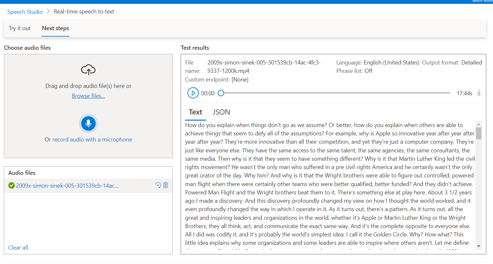
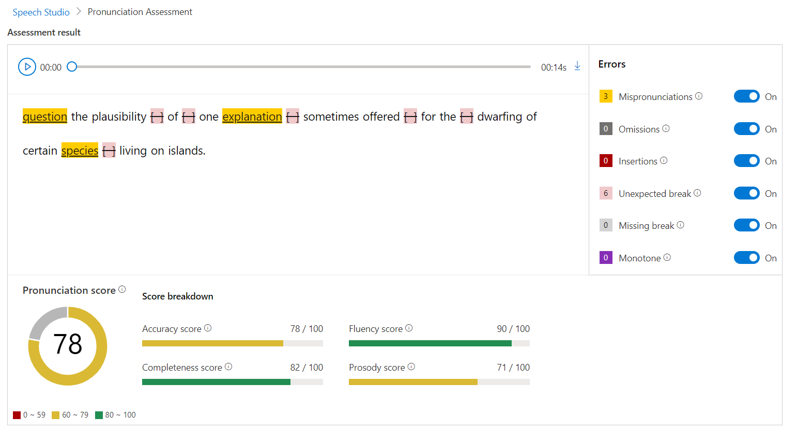
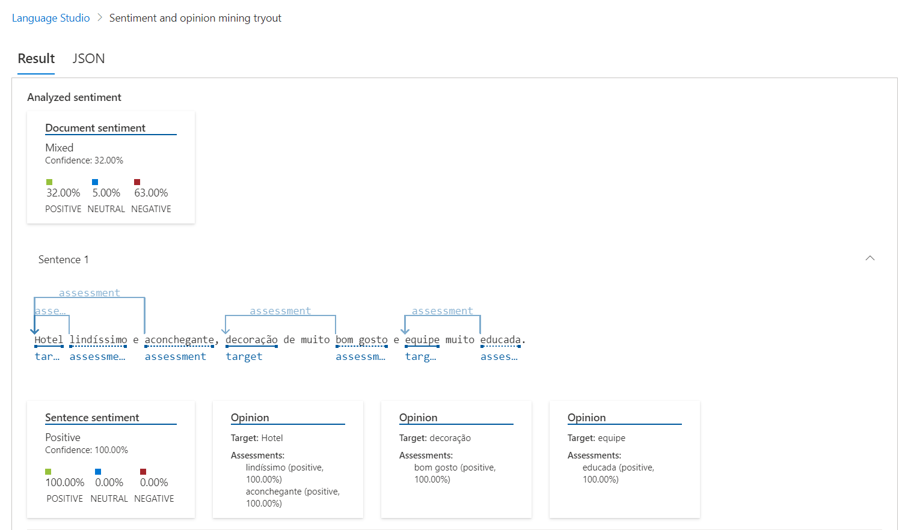

# Laboratório 03

This repository is about the Laboratory number 3 did in the contexto of "Microsoft Azure AI Fundamentals" bootcamp in the Digital Innovation One platform. 

The objective is to explore the Natural Language Processing resources and services in Azure Cloud Platform.

# Serviços testados

The services are available in the links:
  - https://speech.microsoft.com/portal (Speech Studio), and
  - https://language.cognitive.azure.com/ (Language Studio)

It was tested using free credits provided by Azure itself.

1. **Real Time Speech to Text**

I'd downloaded de audio of TEDx talk "How great leaders inspire action" by Simon Sinek, availabe in https://www.ted.com/talks/simon_sinek_how_great_leaders_inspire_action and tried the Real-time speech recognition service.

It successful convert all the file audio to text.

2. **Pronunciation Assessment with speech to Text**

This service allow us to assess our own pronunciation and gives a feedback about it.

I'd tested recording my voice when reading the Sample texts provided.

3. **Analyze sentiment and opinions**

This service resides in the Language Studio.

It provides sentiment labels between "negative", "neutral" or "positive" to sentences and documents.

I'd copied the firs four reviews about "Quinta Santa Bárbara" resourt located in Pirenópolis city (Goiás, Brazil) from TripAdvisor.

The results showed that the reviews was majory negative (63%). 